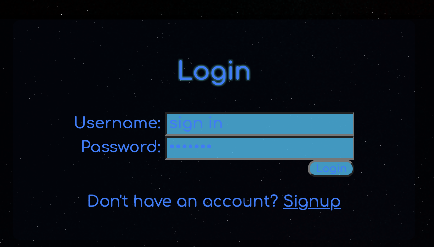
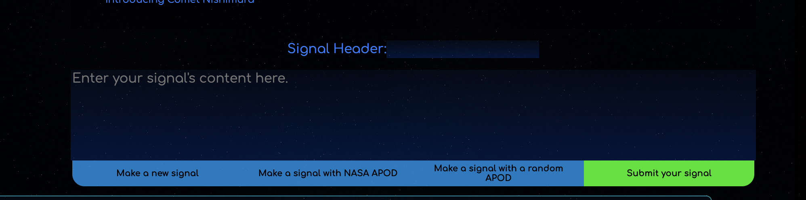

# SpaceBook

This project is a website that allows users to view and post NASA images of the day. It utilizes a MySQL database for storing image data and Handlebars.js for rendering web pages.

## Table of Contents

- [Getting Started](#getting-started)
  - [Prerequisites](#prerequisites)
  - [Installation](#installation)
- [Database Structure](#database-structure)
- [Usage](#usage)
- [License](#license)

## Getting Started

### Prerequisites

Before you begin, ensure you have the following prerequisites installed:

- Node.js: [Node.js Installation Guide](https://nodejs.org/)
- MySQL: [MySQL Installation Guide](https://dev.mysql.com/doc/mysql-installation-excerpt/en/)

### Installation

1. Clone the repository:

   ```bash
   git clone git@github.com:IkonicRes/SpaceBook.git

## Database Structure

The MySQL database for this project consists of the following tables:


* user: Stores user information (The user's ID, username, password, and a profile picture URL).
* topic: Stores the post topic names and assigns an ID to each.
* post: Stores the posts the users make. (An ID for each, amount of likes, the poster's user ID, a title, optional media source, text content, a date, and a topic and apod id)
* comment: Stores the posts comments. (The poster's ID, the ID of the post, amount of likes, the comment text, timestamp etc.)
* like: Stores the user information for a like on a post or comment(Whodunit).
* apod: Stores NASA images of the day. (Assigns each new unique APOD posted an ID and adds it to the table.)

You can find the database schema in the ./db/schema.sql file.

## Usage

1. Access the website by opening a web browser and navigating to https://spacebook-5e89d6d6f153.herokuapp.com/.


2. Users can sign up and log in to post to the platform.



3. NASA's APOD is a brilliant collection of stunning images taken from telescopes, photographers, satellites, and other sources. By default it returns the APOD - or "Astronomy Picture of the Day", but you also have the option of getting a random APOD from the archives. You can then either post your thoughts on the image of the day, a random requested APOD, or simply hit "Make a new signal" before submitting if you would like to post a random thought without attaching APOD. If APOD is not attached, your post will be put in the "General Discussion", otherwise the AI will do its best to categorize the post as best it can under the existing categories. 



4. Users can browse and view previously posted images.

5. The AI is still early and while it's not bad, it definitely needs better label data, as there still remains significant overlap.

## License

MIT License
Copyright (c) 2012-2023 Michael Ikonomou and others

Permission is hereby granted, free of charge, to any person obtaining
a copy of this software and associated documentation files (the
"Software"), to deal in the Software without restriction, including
without limitation the rights to use, copy, modify, merge, publish,
distribute, sublicense, and/or sell copies of the Software, and to
permit persons to whom the Software is furnished to do so, subject to
the following conditions:

The above copyright notice and this permission notice shall be
included in all copies or substantial portions of the Software.

THE SOFTWARE IS PROVIDED "AS IS", WITHOUT WARRANTY OF ANY KIND,
EXPRESS OR IMPLIED, INCLUDING BUT NOT LIMITED TO THE WARRANTIES OF
MERCHANTABILITY, FITNESS FOR A PARTICULAR PURPOSE AND
NONINFRINGEMENT. IN NO EVENT SHALL THE AUTHORS OR COPYRIGHT HOLDERS BE
LIABLE FOR ANY CLAIM, DAMAGES OR OTHER LIABILITY, WHETHER IN AN ACTION
OF CONTRACT, TORT OR OTHERWISE, ARISING FROM, OUT OF OR IN CONNECTION
WITH THE SOFTWARE OR THE USE OR OTHER DEALINGS IN THE SOFTWARE.
